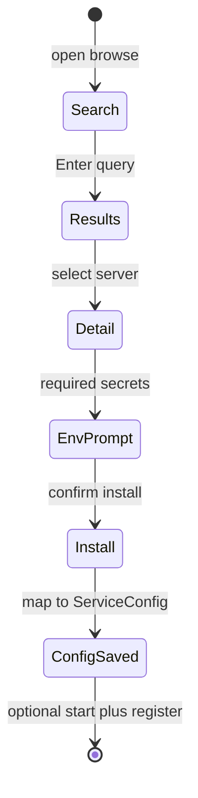
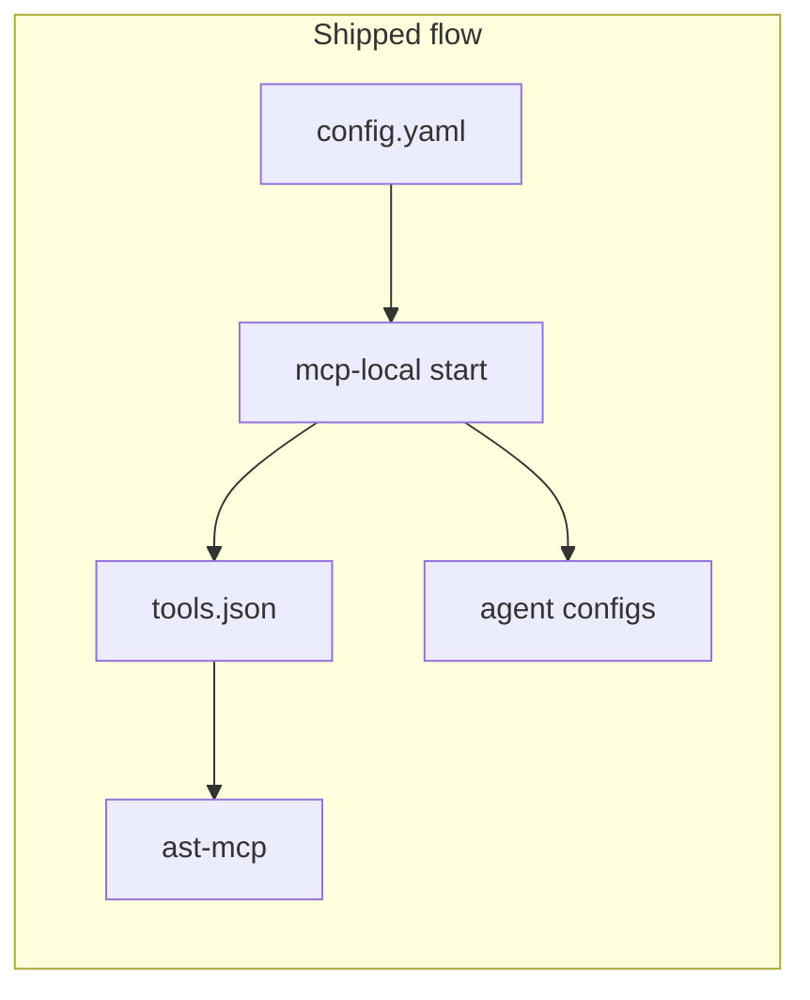
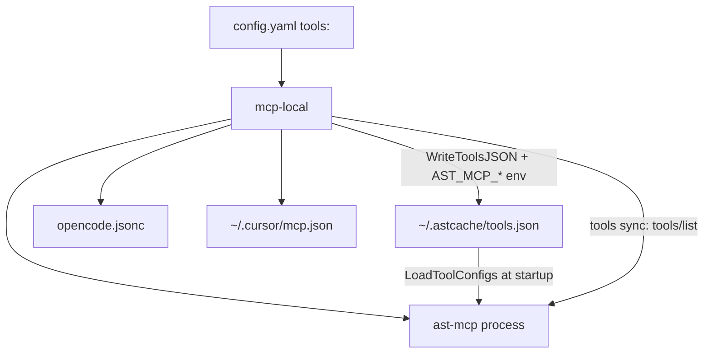

# mcp-local: align code with stated goals

**Status:** implemented (Phases A–F + tools.json bridge)  
**Created:** 2026-05-18  
**Last reviewed:** 2026-05-21

## Overview

Alignment plan for mcp-local as a local MCP control plane: lifecycle, multi-agent registration (OpenCode, Cursor, Claude Desktop), stdio-aware status, and ast-context-cache tool policy via **`~/.astcache/tools.json`** ([`internal/mgr/asttools`](../internal/mgr/asttools)).

## Implementation todos

- [x] **agents-cursor** — `internal/mgr/agents`, `cursor`, `claudedesktop`; `RegisterAll` / `DeregisterAll` on start/stop/register
- [x] **stdio-status** — `internal/mgr/runtime`; status uses port or PID file
- [x] **tools-sync-env** — `tools sync`, `active_tier` / `code_mode` / `tools.json` via `asttools.ApplyStartEnv`
- [x] **lifecycle-polish** — `no_build_on_start`, `stop --deregister` (default true), `jsonagent` for agent configs
- [x] **tests-ci-docs** — `make test` / `check`, `.github/workflows/ci.yml`, README + examples
- [x] **tools-json-bridge** — `internal/mgr/asttools`; `tools apply`; no `AST_MCP_DISABLED_TOOLS`
- [x] **json-command** — `mcp-local json tools <service>`
- [ ] **catalog-tui** — TUI: search MCP Registry catalog, install, append to `config.yaml` (see Phase G below)
- [ ] **registry-enrichment** (later) — Optional [mcpservers.org](https://mcpservers.org/) metadata on top of Registry API results

---

## [mcpservers.org](https://mcpservers.org/) vs MCP standards — can mcp-local implement “all” of it?

**Short answer: No.** [mcpservers.org](https://mcpservers.org/) is a **downstream catalog** (“Awesome MCP Servers”, 8000+ listings, categories, featured/sponsor slots). It is **not** a protocol specification. It aggregates public server metadata; the normative formats live elsewhere:

| Layer | Authority | What it standardizes |
|-------|-----------|----------------------|
| **MCP protocol** | [modelcontextprotocol.io](https://modelcontextprotocol.io/) | JSON-RPC: `initialize`, `tools/*`, `resources/*`, `prompts/*`, transports (stdio, Streamable HTTP, SSE), etc. |
| **Registry metadata** | [MCP Registry](https://modelcontextprotocol.io/registry/about) | [`server.json`](https://github.com/modelcontextprotocol/registry/blob/main/docs/reference/server-json/generic-server-json.md) — name, packages (npm/PyPI/Docker), `transport`, `environmentVariables`, install hints |
| **Marketplace UI** | [mcpservers.org](https://mcpservers.org/) | Human discovery; pulls from ecosystem (registry + community submissions); promotes [Slim Tools](https://slim.tools/) |

Per the [registry docs](https://modelcontextprotocol.io/registry/about): hosts (Cursor, Claude) should consume **aggregators/registries via REST**, not require every launcher to implement the full registry. **mcp-local** is a **local** supervisor for **your** binaries and `~/.mcp-local/config.yaml` — a different job than publishing to or browsing mcpservers.org.

### What mcp-local already covers (local MCP ops)

| Concern | mcp-local | Registry / mcpservers.org |
|---------|-----------|------------------------------|
| Start/stop local binaries | Yes | N/A (catalog only) |
| stdio + HTTP services | Yes (`type`, `port`, `mcp_url`) | `server.json` `packages[].transport` |
| Env vars for a server | Yes (`env`, `AST_MCP_*`) | `environmentVariables` in `server.json` |
| Register with Cursor / OpenCode / Claude | Yes | Client installs from marketplace separately |
| Tool list / policy (ast) | `tools sync`, TUI, `tools.json` on start | Per-server docs |
| Publish `io.github.user/server` to official registry | No | `mcp-publisher` CLI |
| Browse 8000+ catalog entries | No | mcpservers.org UI |
| Namespace DNS/GitHub verification | No | Registry auth |
| OAuth remote MCP (hosted SaaS) | No (agent handles) | Listed servers often document OAuth URLs |

### MCP protocol features mcp-local does **not** implement (by design)

mcp-local is **not** an MCP server and **not** a full MCP **client**. It does not need to implement the full protocol surface for mcpservers.org compliance:

- `tools/call`, `resources/*`, `prompts/*`, subscriptions, roots, sampling, elicitation, logging
- Full session negotiation beyond minimal `tools/list` for sync
- Registry OpenAPI as a host application

Those belong to **MCP servers** (e.g. ast-mcp) and **agents** (Cursor, OpenCode).

### Config format mismatch

| | mcp-local | Official registry |
|---|-----------|-------------------|
| File | `~/.mcp-local/config.yaml` | `server.json` in repo |
| Audience | Private/local stack, custom paths (`${HOME}/git/...`) | Public discovery, npm/Docker coordinates |
| Private servers | Supported | [Explicitly not supported](https://modelcontextprotocol.io/registry/about) by official registry |

Most entries on mcpservers.org are **install-and-run** via npx/docker or **remote URLs** — not the same as supervising a dev build of `ast-mcp` from `~/git/`.

### Phase G — Catalog TUI: search, install, add to mcp-local (user request)

**Goal:** From a Bubble Tea UI, search public **MCP servers** (same ecosystem as [mcpservers.org](https://mcpservers.org/)), run a supported **install** path, and append a `ServiceConfig` to `~/.mcp-local/config.yaml` (optionally `start` + agent register).

**Data source (confirmed):**

| Priority | Source | Notes |
|----------|--------|--------|
| **Primary** | [Official MCP Registry API](https://modelcontextprotocol.io/registry/about) (`registry.modelcontextprotocol.io`, OpenAPI in [modelcontextprotocol/registry](https://github.com/modelcontextprotocol/registry)) | Stable `server.json`-shaped metadata: `packages[]`, `transport`, `environmentVariables` |
| **Later** | mcpservers.org enrichment | No public search API documented; add categories/featured/links via scrape or partner feed **after** Registry path works — do not block v1 |

**Not in scope:** Agent Skills ([skills.sh](https://skills.sh/) / [agentskills.io](https://agentskills.io/)) — different artifact (`SKILL.md` vs MCP server).

#### UX flow (new `mcp-local browse` TUI)



- Entry points: **`mcp-local browse`**; config wizard item **`[Browse MCP catalog]`** ([internal/tui/wizard.go](../internal/tui/wizard.go)).
- **Search:** `textinput` + debounced HTTP; client-side filter if API has no full-text (list + filter by name/description).
- **Results:** scrollable list (name, title, transport badge); pagination via Registry cursor (`GET /v0.1/servers`).
- **Detail:** description, repository link, package type (npm / docker / remote), required env vars.
- **Install:** map `packages[0]` (or user picks) → `ServiceConfig` via [internal/mgr/registry/map.go](../internal/mgr/registry/map.go) (new).

#### Install mapping (`server.json` → config.yaml)

| Registry `transport` / package | mcp-local `ServiceConfig` |
|--------------------------------|---------------------------|
| `stdio` + npm | `command`: `npx` or cached binary; `args`: `["-y", "<package>"]`; `type`: `stdio` |
| `stdio` + local path | After `npm install -g` or copy binary — TUI shows command to run |
| HTTP / remote URL | `type`: `http`, `mcp_url`, `port` if localhost; **no** local `command` if SaaS-only |
| Docker | `command`: `docker`, `args`: `run ...` (user confirm); document socket/volume limits |

**v1 install actions (pick one per package type):**

1. **Config-only (fastest):** Write YAML + print “run `npx -y …`” / env setup instructions.
2. **Exec install (recommended):** TUI runs `npx -y <pkg>` or `docker pull` with spinner (`tea.Cmd` + `exec.Command`), then sets `command`/`args` from resolved path.
3. **Post-add:** Offer `start <name>` + `RegisterAll` (reuse [lifecycle.go](../cmd/mcp-local/lifecycle.go)).

**Env vars:** Prompt in TUI for `environmentVariables` where `isRequired` / `isSecret`; store under `env:` in YAML (warn: secrets in plaintext — optional `~/.mcp-local/secrets/<name>.env` later).

**Naming:** Service `name` = short slug from registry `name` (e.g. `io.github.foo/bar` → `bar` or full name with sanitization); detect collisions with existing `config.Services`.

#### New code layout

| Path | Responsibility |
|------|----------------|
| `internal/mgr/registry/client.go` | HTTP client, pagination, fetch version detail |
| `internal/mgr/registry/map.go` | `ServerRecord` → `config.ServiceConfig` |
| `internal/mgr/registry/install.go` | Optional `npx` / `docker` runners |
| `internal/tui/catalog.go` | Browse TUI model (search / results / detail / confirm) |
| `cmd/mcp-local/extras.go` | `browse` command |
| `internal/mgr/registry/*_test.go` | Fixtures from sample `server.json`; map tests |

#### CLI parity (non-TUI)

- `mcp-local import registry <serverName>` — same mapper, no TUI (scripting).
- `mcp-local export server.json <service>` — reverse map for publishers (optional).

#### Risks / limits

- **Not every mcpservers.org listing** is in the official Registry (preview, moderation lag) — UI copy: “Catalog via MCP Registry; see mcpservers.org for more.”
- **OAuth / remote-only** servers may register in agents but not run under mcp-local process supervisor.
- **Network required** for browse; offline → existing manual `add` / wizard only.
- Implementing the TUI itself: use existing Charm stack; optional agent skills `ggprompts/tfe@bubbletea` for layout fixes during development (not a runtime dependency).

#### Verification (Phase G)

1. `mcp-local browse` → search “github” → select GitHub MCP → install → new entry in `config.yaml`.
2. `mcp-local start <name>` works for stdio npm package (or documents remote-only).
3. Wizard `[Browse MCP catalog]` reaches same flow.
4. Unit tests: npm stdio and remote URL mapping from fixture JSON.

### Recommended README positioning

- mcp-local = **local control plane** for servers you build or configure yourself.
- [mcpservers.org](https://mcpservers.org/) = **discovery** for public MCP servers; install via npm/Docker or agent UI, then optionally add to `config.yaml` if you want mcp-local to manage lifecycle.
- Official protocol/registry: [modelcontextprotocol.io](https://modelcontextprotocol.io/) and [registry publishing](https://modelcontextprotocol.io/registry/quickstart).

*(Note: [agentskills.io](https://agentskills.io/) is a separate **Agent Skills** format, not MCP; out of scope for mcp-local unless explicitly added later.)*

---

## ast-context-cache updates (local, 2026-05)

Upstream now implements full per-tool policy **without** a cross-repo PR. Reference: [ast-context-cache README — Tool tiers](https://github.com/coma-toast/ast-context-cache/blob/main/README.md#tool-tiers-and-per-tool-overrides).

| Mechanism | Behavior |
|-----------|----------|
| `AST_MCP_TIER` | Global tier: `core` / `extended` / `complete` (default `complete`) |
| `AST_MCP_CODE_MODE` | `false` / `0` disables `execute_code` |
| `AST_MCP_TOOLS_CONFIG` | Path to overrides JSON (default `~/.astcache/tools.json`) |
| `~/.astcache/tools.json` | Per-tool `enabled`, `tier`, `description` — loaded **at ast-mcp startup only** |

Example schema ([`skills/tools.json.example`](../../ast-context-cache/skills/tools.json.example) in ast repo):

```json
{
  "execute_code": { "enabled": false, "tier": "complete", "description": "Disabled by policy" },
  "index_files": { "enabled": true, "tier": "core", "description": "Allow indexing at core tier" }
}
```

Implementation in ast: `LoadToolConfigs()` / `FilterTools()` in `internal/mcp/tools.go`; tests in `internal/mcp/tools_test.go`. **`AST_MCP_DISABLED_TOOLS` does not exist** in ast-context-cache.

ast docs expect mcp-local to:

1. Write `tools.json` from launcher config (same schema), then **restart ast-mcp**.
2. Expose commands: `start`, **`sync`** (tools list → config), **`json tools`** (preview overrides).

---

## Goal (from [README.md](../README.md))

Unified local control plane: `~/.mcp-local/config.yaml`, lifecycle, **OpenCode + Cursor (+ Claude)** registration, and **tool/tier management** for ast-context-cache.

## What already matches (mcp-local)

| Area | Status |
|------|--------|
| Lifecycle + `no_build_on_start` | [cmd/mcp-local/lifecycle.go](../cmd/mcp-local/lifecycle.go), [internal/mgr/config/config.go](../internal/mgr/config/config.go) |
| Multi-agent registration | [internal/mgr/agents/agents.go](../internal/mgr/agents/agents.go), `cursor`, `opencode`, `claudedesktop` |
| `active_tier` / `code_mode` / `tools.json` | [internal/mgr/asttools/toolsjson.go](../internal/mgr/asttools/toolsjson.go) via [process.go](../internal/mgr/process/process.go) |
| `tools apply` / `json tools` | [cmd/mcp-local/extras.go](../cmd/mcp-local/extras.go) |
| Status (port + PID) | [internal/mgr/runtime/status.go](../internal/mgr/runtime/status.go) |
| `tools sync` | [cmd/mcp-local/extras.go](../cmd/mcp-local/extras.go) — MCP `tools/list` → config YAML |
| Tools TUI | [internal/tui/tools.go](../internal/tui/tools.go) |
| Tests + CI | `*_test.go` in config/cursor/opencode/runtime; [.github/workflows/ci.yml](../.github/workflows/ci.yml) |
| Starter example | [examples/config.starter.yaml](../examples/config.starter.yaml) includes `active_tier` |



## Shipped: tool policy

- [`internal/mgr/asttools/toolsjson.go`](../internal/mgr/asttools/toolsjson.go) — writes `~/.astcache/tools.json` (or `tools_config_path`), sets `AST_MCP_TIER`, `AST_MCP_CODE_MODE`, `AST_MCP_TOOLS_CONFIG`
- `mcp-local tools apply <service>` — write overrides without restart
- `mcp-local json tools <service>` — preview overrides JSON
- Restart ast-mcp after TUI edits (overrides load at process start only)

## Future work (not in original plan Phases A–F)

- ~~**Tier defaults on sync**~~ — sync leaves `tier` empty in YAML; only explicit overrides are written to `tools.json` (`DefaultBuiltinTier` used for TUI display/cycle)
- **JSONC comment preservation** on OpenCode write (read strips `//`, write is plain JSON)
- **Cursor reload note** in README — registration is file-only; users may need to reload MCP in Cursor
- **catalog-tui** / **registry-enrichment** — see Phase G and mcpservers.org section above

---

## Target architecture (shipped)



---

## Verification checklist

1. `make test && make check` pass.
2. `mcp-local tools sync ast-context-cache` → YAML populated.
3. TUI: disable `execute_code`, set `index_files` tier `core` → `mcp-local restart ast-context-cache`.
4. `~/.astcache/tools.json` contains overrides; **no** `AST_MCP_DISABLED_TOOLS` in process env.
5. `curl`/MCP `tools/list`: disabled tools absent; promoted tool visible at `AST_MCP_TIER=core` (per ast tests).
6. stdio service shows **running** in `status --plain` when PID file present.
7. `stop` deregisters from OpenCode + Cursor (+ Claude if enabled).

---

## Risk / scope notes

- **Restart required:** ast-mcp reads `tools.json` at process start only.
- **JSONC:** OpenCode config may lose `//` comments on register (documented limitation).
- **Catalog TUI:** deferred — Registry API v1 + install/map; mcpservers.org enrichment later.
