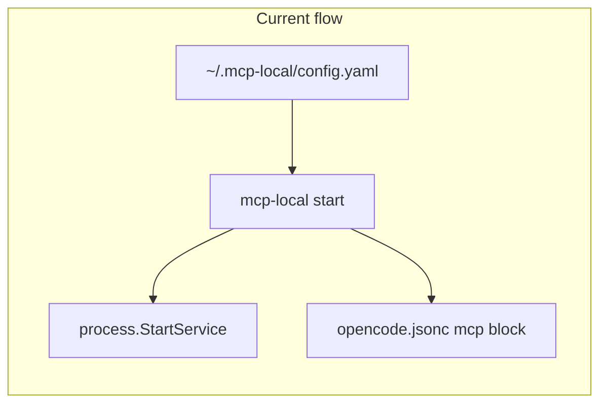
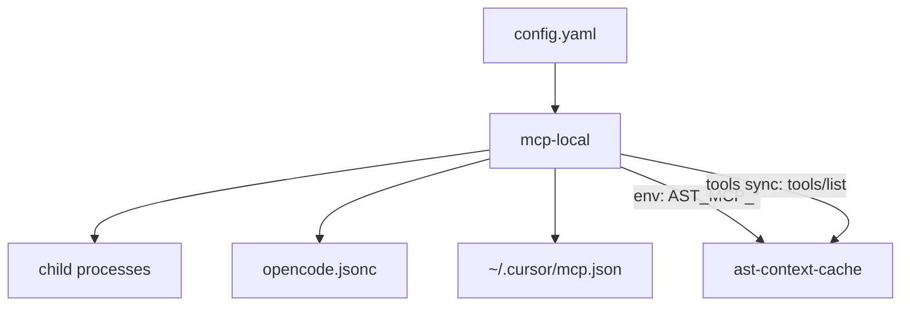

# mcp-local: align code with stated goals

**Status:** implemented  
**Created:** 2026-05-18

## Overview

Review found solid lifecycle + OpenCode integration, but README promises Cursor registration, live tool-tier control for ast-context-cache, and stdio-aware status are missing or only partially implemented. This plan brings code, examples, tests, and a small ast-context-cache extension in line with the stated control-plane goal.

## Implementation todos

- [ ] **agents-cursor** — Add `internal/mgr/cursor` + shared `agents.RegisterAll`; wire start/restart/register/deregister for OpenCode and `~/.cursor/mcp.json`
- [ ] **stdio-status** — PID-aware running detection in status/stop; fix register to use `RegisterServices` mapping
- [ ] **tools-sync-env** — `active_tier`/`code_mode` env on start; tools sync via MCP `tools/list`; `AST_MCP_DISABLED_TOOLS` in ast-context-cache + apply from YAML
- [ ] **lifecycle-polish** — `build_on_start` flag, stop `--deregister`, JSONC merge best-effort
- [ ] **tests-ci-docs** — Unit tests, Makefile test/check, GitHub CI, README + examples update

---

## Goal (from [README.md](../README.md))

A **unified local control plane** for MCP servers: portable `~/.mcp-local/config.yaml`, lifecycle commands, **OpenCode + Cursor** agent registration, and **tool/tier management** (especially ast-context-cache).

## What already matches

| Area | Status |
|------|--------|
| Lifecycle (`start` / `stop` / `restart` / `rebuild`) | Implemented in [cmd/mcp-local/lifecycle.go](../cmd/mcp-local/lifecycle.go), [internal/mgr/process/process.go](../internal/mgr/process/process.go) |
| OpenCode `mcp` block merge | [internal/mgr/opencode/opencode.go](../internal/mgr/opencode/opencode.go) — remote (HTTP) + local (stdio) via `RegisterServices` on start/restart |
| Portable YAML + `${HOME}` | [internal/mgr/config/config.go](../internal/mgr/config/config.go) |
| Status TUI + `--plain` | [internal/statusui/statusui.go](../internal/statusui/statusui.go) |
| Health, logs, dashboard open, wizard, `add` | [cmd/mcp-local/extras.go](../cmd/mcp-local/extras.go), [internal/tui/wizard.go](../internal/tui/wizard.go) |
| Build compiles | `go build ./cmd/mcp-local` succeeds |



## Gaps (code vs README)

### 1. Cursor `mcp.json` — advertised, not implemented

README line 40 claims Cursor support; grep shows **no** `mcp.json` writer. Global Cursor config uses:

```json
{ "mcpServers": { "name": { "url": "..." } } }
```

(`~/.cursor/mcp.json`)

### 2. Tool tier TUI — local YAML only, no server effect

[internal/tui/tools.go](../internal/tui/tools.go) edits `tools:` in config and saves YAML. Nothing applies settings on start:

- [examples/config.starter.yaml](../examples/config.starter.yaml) has **no** `tools:` block → `mcp-local tools` shows empty for ast-context-cache.
- ast-context-cache exposes tiers via **`AST_MCP_TIER`** / **`AST_MCP_CODE_MODE`** (`ast-context-cache/internal/mcp/types.go`), not per-tool YAML.
- Per-tool `enabled` / custom `description` in mcp-local config **do not** change what the MCP server advertises today.

### 3. stdio services invisible in `status`

[internal/portutil/port.go](../internal/portutil/port.go) treats `port <= 0` as not running. model-proxy-style stdio entries always show **stopped** even when PID files exist ([internal/mgr/process/process.go](../internal/mgr/process/process.go)).

### 4. `register` command inconsistency

[cmd/mcp-local/extras.go](../cmd/mcp-local/extras.go) `register` calls `RegisterRemote` only — **skips** stdio services (no `mcp_url`). Should use the same mapping as `RegisterServices`.

### 5. Operational / quality gaps

- **Build on every start**: `StartService` always runs `build_command` — slow for ast-context-cache; add `build_on_start: false` (default true for backward compat) or separate `mcp-local rebuild` only path.
- **JSONC**: read strips `//` comments; write emits plain JSON (comments lost on register) — preserve comments via surgical merge or document limitation.
- **No tests / CI**: zero `*_test.go`, no `.github/workflows`.
- **stop** does not deregister agents — stale OpenCode/Cursor entries when servers stop; add `stop --deregister` or default deregister for stopped services with `mcp_url`.

---

## Target architecture



---

## Implementation plan

### Phase A — Agent registration (mcp-local only)

**New package** `internal/mgr/agents/` (or split `cursor/` + keep `opencode/`):

- **`agents.RegisterAll(services []ServiceConfig, targets Agents)`** where `Agents` is `{OpenCode, Cursor}` booleans (default both true).
- **Cursor writer** — path `~/.cursor/mcp.json`, merge `mcpServers`:
  - HTTP: `{ "url": "<mcp_url>" }` (and optional `headers` from service env later).
  - stdio: `{ "command": "<bin>", "args": [...], "env": {...} }` mirroring OpenCode local entries.
- Refactor [internal/mgr/opencode/opencode.go](../internal/mgr/opencode/opencode.go) to share **`serviceToEntry`** logic with Cursor (extract to `agents/entry.go`).
- Wire **`start` / `restart` / `rebuild` / `register`** to register **both** agents.
- Add **`deregister`** for Cursor (symmetric to OpenCode).
- Config knob (optional): top-level `agents: { opencode: true, cursor: true }` in YAML.

**Files:** new `internal/mgr/cursor/cursor.go`, refactor `opencode.go`, update [cmd/mcp-local/lifecycle.go](../cmd/mcp-local/lifecycle.go), [cmd/mcp-local/extras.go](../cmd/mcp-local/extras.go).

### Phase B — stdio-aware status and stop

- Extend status rows: **running** if `port > 0 && port listening` **OR** PID file exists and process alive (`signal 0` / `ps`).
- `PrintPlain` and bubbletea model use same helper in new `internal/mgr/runtime/status.go`.
- **stop**: after stop, optional deregister (flag `--deregister` default **true** for services that were running, or always deregister named service).

### Phase C — Tool management (mcp-local + small ast-context-cache change)

**C1 — Service-level tier env (mcp-local)**

Extend [internal/mgr/config/config.go](../internal/mgr/config/config.go):

```yaml
services:
  - name: ast-context-cache
    active_tier: extended   # maps to AST_MCP_TIER
    code_mode: true         # AST_MCP_CODE_MODE
    tools: [...]
```

In [internal/mgr/process/process.go](../internal/mgr/process/process.go) `StartService`, merge into `cmd.Env` before launch (service-specific env wins over defaults).

**C2 — `tools sync <service>` (mcp-local)**

- HTTP MCP client: POST JSON-RPC `initialize` + `tools/list` to `mcp_url` (reuse health client timeout).
- Populate `tools:` in config from server names/descriptions; preserve existing `enabled` / `tier` / `description` when name matches.
- Subcommand on `tools` or `mcp-local tools sync ast-context-cache` (document in README).

**C3 — Apply per-tool overrides (ast-context-cache + mcp-local)**

ast-context-cache change (sibling repo, required for “enable/disable” to be real):

- Parse `AST_MCP_DISABLED_TOOLS` (comma-separated) in `FilterTools` / `IsToolAllowed`.
- Optional: `AST_MCP_TOOL_TIER_OVERRIDES` as JSON `{"tool":"tier"}` for TUI tier edits (if we want per-tool tier beyond global `active_tier`).

mcp-local on start:

- Build `AST_MCP_DISABLED_TOOLS` from `tools[]` where `enabled: false`.
- Build tier overrides JSON from tools where `tier` differs from compiled default (after sync seeds defaults).

**C4 — TUI improvements** [internal/tui/tools.go](../internal/tui/tools.go)

- Prompt to run sync when `tools` empty.
- Save still writes YAML; remind user to `restart` service to apply env.
- Seed [examples/config.starter.yaml](../examples/config.starter.yaml) with `active_tier: complete` and comment to run `tools sync`.

**Note on custom descriptions:** MCP clients read descriptions from `tools/list`. True override requires ast-mcp to merge YAML/env overrides into listed tools — include in C3 if doing “full” honestly; otherwise narrow README to “descriptions stored for export/rules” until ast supports overrides.

### Phase D — Lifecycle polish

- **`build_on_start`** (default `true`) on `ServiceConfig`; when false, only `rebuild` runs build.
- **`register`**: call shared `RegisterServices` for all targets, not `RegisterRemote` only.
- **JSONC preservation (best effort):** when updating `mcp` block, read raw file, replace only the `mcp` object subtree via regex/JSON patch, or use `jsonc` library — avoid rewriting entire file when possible.

### Phase E — Tests and CI

Add tests (no network in unit tests; use temp dirs):

| Package | Cases |
|---------|--------|
| `internal/mgr/opencode` | merge remote/local, idempotent register, deregister |
| `internal/mgr/cursor` | HTTP url + stdio command merge into existing `mcp.json` |
| `internal/mgr/config` | `${HOME}` / `~/` expansion |
| `internal/mgr/runtime` | running detection port vs PID |
| `cmd/...` | cobra integration smoke with `config.yaml` fixture |

- **Makefile**: `test`, `check` targets.
- **`.github/workflows/ci.yml`**: `go test ./...` on push.

### Phase F — Documentation and examples

Update [README.md](../README.md) to match behavior:

- Document Cursor path, dual registration, `tools sync`, `active_tier`, `build_on_start`, stop/deregister.
- Remove or qualify “Storybook” unless an example is added.
- Add `examples/model-proxy.service.yaml` stdio snippet.

---

## Verification checklist

1. `make && make test` pass.
2. Copy starter config → `mcp-local start ast-context-cache` → ports 7821/7830 up, OpenCode + Cursor configs contain ast entry.
3. `mcp-local tools sync ast-context-cache` → populates tools; disable one tool → restart → `tools/list` omits it (after ast change).
4. stdio service (model-proxy) shows **running** in `status --plain` when started.
5. `mcp-local stop ast-context-cache` → deregister removes entries from both agent configs.
6. `register` alone updates stdio + HTTP services correctly.

---

## Risk / scope notes

- **Cross-repo:** Per-tool enable/tier/description at the MCP protocol level needs a small PR in ast-context-cache; mcp-local can ship Phases A, B, D, E first while C3 lands in parallel.
- **Cursor restart:** Registration is file-only; README should say users may need to reload MCP in Cursor (same as today for manual edits).
- **Linux:** `lsof`/`ps` usage in portutil is macOS-oriented; verify Linux `lsof` flags or add `ss` fallback in status PID path.
